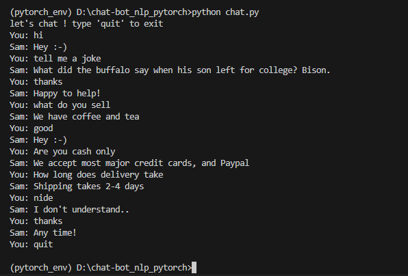
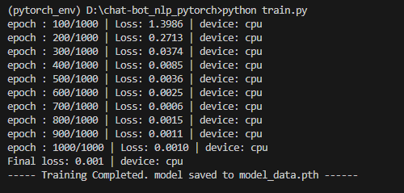

# Chat-bot - intent based nlp bot - Pytorch

a basic chat bot based on predefined intents and predefined responses.

A custom simple deep learning model is trained to find the intent of the user input based on the intent the system will provide the predefined response

---

## Stuffs

- NLP - (Preprocessing like stemming)
- Bag of words
- Pytorch for model development

---

## Screenshots

Chat cli


Training the model


## Installation

Install my-project with pip, git clone this repo then cd to the folder.

```bash
  pip install -r requirements.txt
```

## Run the App

Train the model.

```bash
   python train.py
```

Run the Chat Cli

```bash
   python chat.py
```

#### Authors

- [@Amaithi Chirasan](https://www.github.com/amaithi-sam)
